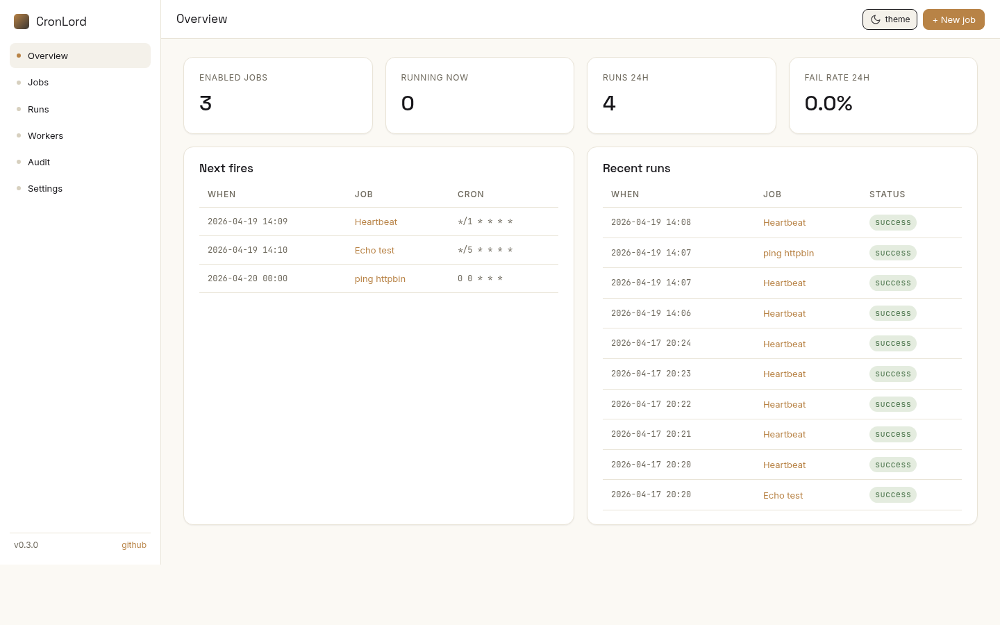
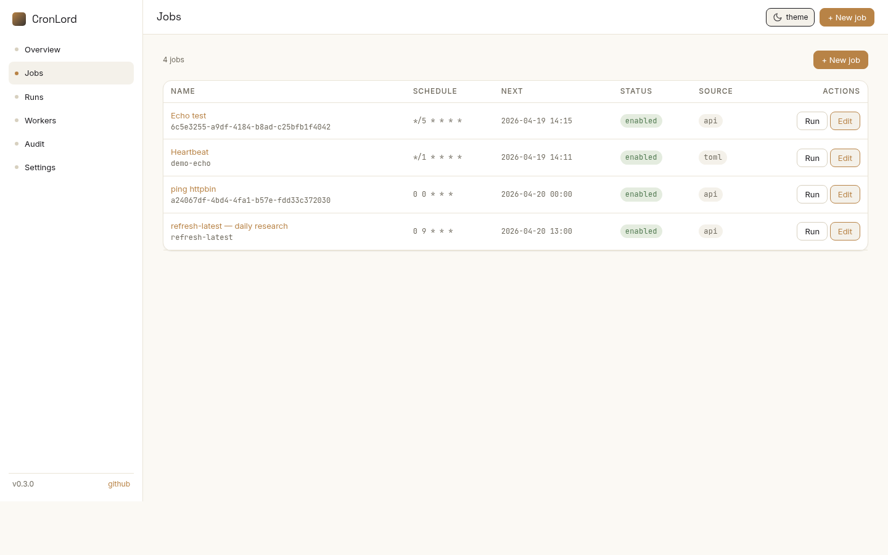
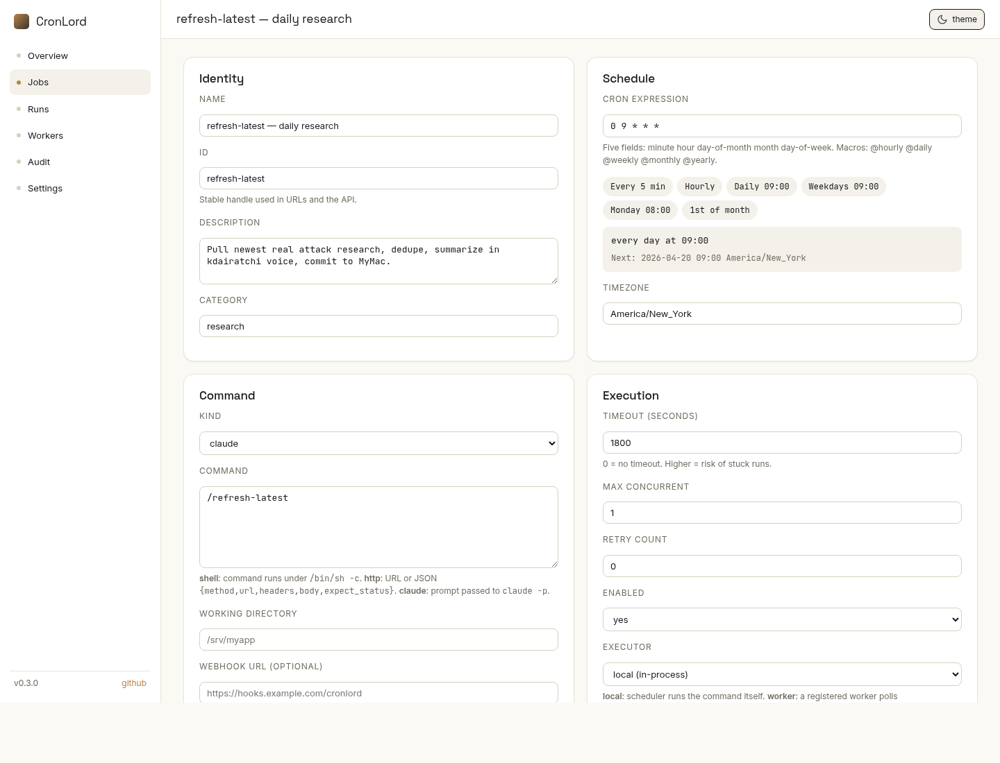
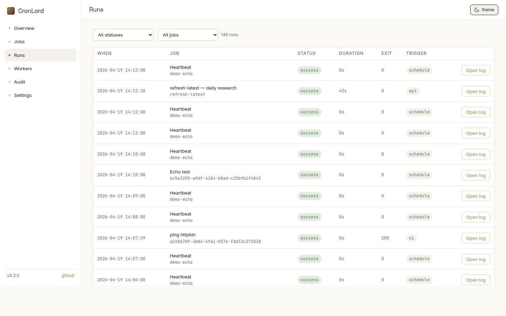
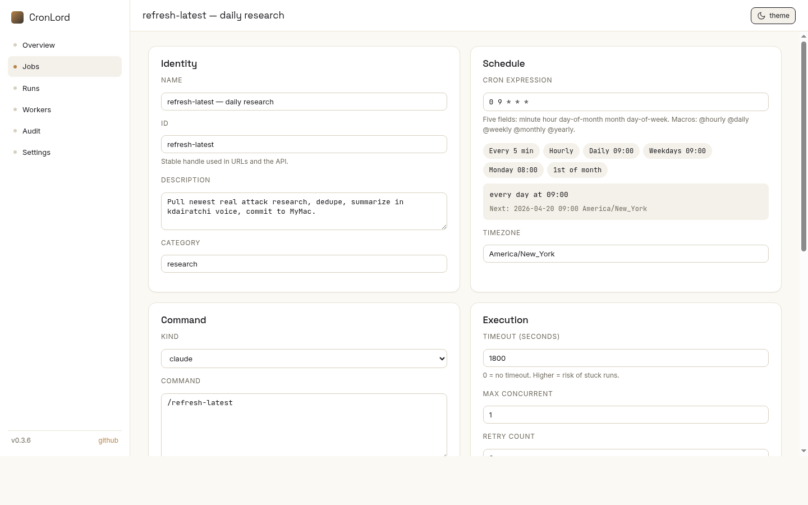
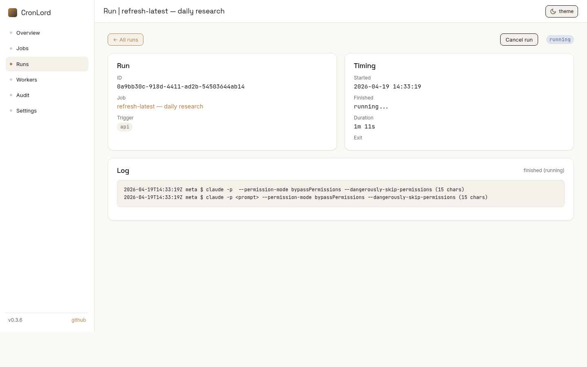
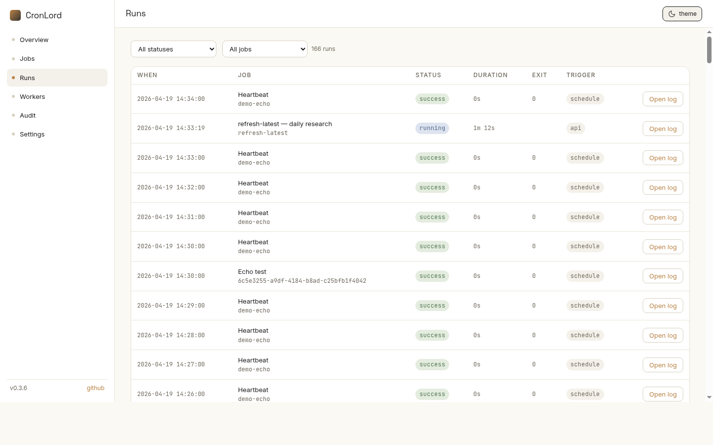

# CronLord

<p align="center">
  
</p>

[](https://github.com/kdairatchi/CronLord/actions/workflows/ci.yml)
[](https://github.com/kdairatchi/CronLord/actions/workflows/release.yml)
[](./LICENSE)

Single-binary Crystal cron scheduler. Web UI, REST API, remote workers, GitHub sync, AI jobs, and audit trail — one process, ~15 MB idle.

---

## Install

### From source

```sh
git clone https://github.com/kdairatchi/CronLord
cd CronLord
shards install
shards build --release
./bin/cronlord server
```

Open <http://localhost:7070>.

### Docker

```sh
docker run -p 7070:7070 \
  -v cronlord-data:/var/lib/cronlord \
  ghcr.io/kdairatchi/cronlord:latest server
```

The GHCR image is signed with cosign, carries an SPDX SBOM and SLSA provenance, and is Trivy-scanned for HIGH/CRITICAL CVEs before signing.

### Tarball

Download a release tarball from the [releases page](https://github.com/kdairatchi/CronLord/releases), verify, and install:

```sh
curl -fsSL https://github.com/kdairatchi/CronLord/releases/latest/download/install.sh | sh
```

`install.sh` checks the `.sha256` sidecar before writing anything to disk.

---

## Features

| Area | What ships |
|---|---|
| **Scheduler** | Tickless, IANA timezones, DST-correct, macro expressions (`@hourly`, `@daily`, `@weekly`, …) |
| **Job kinds** | `shell` (subprocess), `http` (outbound request), `claude` (prompt → `claude -p`) |
| **Workers** | Remote workers over HMAC-signed lease protocol; reference worker in the same binary |
| **Run control** | Cancel queued or running jobs from UI or API |
| **Notifications** | Webhook and Slack channels, per-job configuration |
| **Logging** | Per-run stdout/stderr capture; SSE live tail with line numbers, ANSI color, copy, auto-scroll |
| **GitHub webhook** | `POST /webhooks/github` — HMAC-SHA256 verified, fires jobs tagged `category=github:push` |
| **GitHub sync** | Fetch a `cronlord.toml` from any repo and upsert jobs tagged `source=github` |
| **Observability** | Prometheus `/metrics`, audit trail at `/audit`, healthcheck at `/healthz` |
| **Self-check** | `cronlord doctor` — 13 probes covering DB, config, workers, tzdata, security posture |
| **UI** | Icon sidebar, action dropdowns per job row, toast notifications, empty states, settings wizard |
| **Supply chain** | cosign signature, SPDX SBOM, SLSA provenance, `.sha256` release sidecars |
| **Storage** | SQLite only — no external database required |

---

## Screenshots

<p align="center">
  
  <br><em>Dashboard — queued, running, recent runs, failure rate at a glance.</em>
</p>

<p align="center">
  
  <br><em>Jobs — schedule, next fire in local TZ, kind, enabled state, action dropdown.</em>
</p>

<p align="center">
  
  <br><em>Edit — cron expression, timezone, kind, working dir, env vars, notifications.</em>
</p>

<p align="center">
  
  <br><em>Live runs — pulsing running-status badge, cancel button per run.</em>
</p>

<p align="center">
  
  <br><em>Job running — real-time status with elapsed time.</em>
</p>

<p align="center">
  
  <br><em>Run log — SSE live tail, line numbers, ANSI color, copy button, auto-scroll.</em>
</p>

<p align="center">
  
  <br><em>Runs history — exit code, duration, log link per run.</em>
</p>

---

## Configuration

Copy and edit the example:

```sh
cp cronlord.toml.example cronlord.toml
```

Environment variables override every key (`CRONLORD_HOST`, `CRONLORD_PORT`, `CRONLORD_DATA`, `CRONLORD_DB`, `CRONLORD_LOG_DIR`, `CRONLORD_ADMIN_TOKEN`).

```toml
[server]
host = "127.0.0.1"
port = 7070

## Require Authorization: Bearer <token> on /api/*
## Generate: openssl rand -hex 32
admin_token = "replace-me-with-a-long-random-string"

[storage]
## SQLite DB and per-run logs live here
data_dir = "/var/lib/cronlord"
# db_path  = "/var/lib/cronlord/cronlord.db"   # override DB location
# log_dir  = "/var/lib/cronlord/logs"           # override log location

## GitHub integration — controls both webhook trigger and job sync
[github]
webhook_secret = "replace-me-with-a-long-random-string"   # for POST /webhooks/github

## Job sync: fetch [[jobs]] from a remote TOML and upsert into the DB
repo   = "owner/repo"      # required
branch = "main"
path   = "cronlord.toml"   # path within the repo
token  = "ghp_..."         # PAT for private repos; omit for public

## Declarative jobs — re-upserted at boot, tagged source = "toml"
[[jobs]]
id       = "heartbeat"
name     = "Heartbeat"
schedule = "*/1 * * * *"
command  = "date -u"
kind     = "shell"
enabled  = true
```

> [!NOTE]
> Jobs defined in `cronlord.toml` are re-upserted on every boot. Deleting them from the UI is non-destructive — they return on restart. Use the UI or API for jobs you want full control over.

---

## Job Kinds

### shell — daily backup

Runs a subprocess. `command` is passed to `/bin/sh -c`.

```toml
[[jobs]]
id          = "nightly-backup"
name        = "Nightly DB dump"
schedule    = "0 3 * * *"
kind        = "shell"
command     = "/usr/local/bin/backup.sh --dest s3://mybucket/$(date +%F).tar.gz"
timeout_sec = 1800
enabled     = true
```

stdout and stderr are captured to a per-run log file and streamable via SSE at `GET /api/runs/:id/log`.

### http — health check POST

Fires an outbound HTTP request. Useful for polling endpoints or calling webhooks.

```toml
[[jobs]]
id       = "health-check"
name     = "API health check"
schedule = "*/5 * * * *"
kind     = "http"
command  = "POST https://api.example.com/health"
enabled  = true
```

> [!NOTE]
> The `http` runner enforces SSRF guards — requests to RFC-1918 private ranges are blocked by default. The Doctor check `private_nets_guard` verifies this is active.

### claude — nightly AI digest

Passes `command` as a prompt to `claude -p`. Requires the Claude CLI on `$PATH`.

```toml
[[jobs]]
id       = "nightly-digest"
name     = "Nightly AI digest"
schedule = "0 7 * * *"
kind     = "claude"
command  = "Summarize the last 24 hours of /var/log/app.log and output a 5-bullet digest."
enabled  = true
```

The full model response is captured as the run log. The Doctor `claude_cli` probe confirms the binary is present and executable before you schedule jobs of this kind.

---

## GitHub Integration

### Webhook — fire jobs on push

Receive GitHub events and trigger matching jobs automatically.

**1. Generate a webhook secret**

```sh
openssl rand -hex 32
```

**2. Add to `cronlord.toml`**

```toml
[github]
webhook_secret = "your-generated-secret"
```

**3. Register in GitHub repo settings**

- Payload URL: `https://your-cronlord-host/webhooks/github`
- Content type: `application/json`
- Secret: the value from step 1
- Events: select the events you want (push, release, etc.)

**4. Tag jobs to fire on push**

Add `category=github:push` as a label to any job (via UI or API). On a verified push event, all matching jobs are queued immediately.

CronLord validates every incoming webhook with HMAC-SHA256 against the `X-Hub-Signature-256` header. Requests with an invalid or missing signature are rejected with 401.

---

### Sync — pull jobs from a repo

Keep your job definitions in version control. CronLord fetches a `cronlord.toml` from any GitHub repo and upserts the `[[jobs]]` entries into the local DB, tagged `source=github`.

**1. Create a `cronlord.toml` in your repo**

```toml
[[jobs]]
id       = "deploy-staging"
name     = "Deploy to staging"
schedule = "0 2 * * 1-5"
kind     = "shell"
command  = "/deploy/staging.sh"
enabled  = true
```

**2. Configure sync in `cronlord.toml`**

```toml
[github]
repo   = "myorg/myrepo"
branch = "main"
path   = "cronlord.toml"
token  = "ghp_..."          # omit for public repos
```

**3. Trigger sync**

From the CLI:

```sh
cronlord github sync
```

From the API:

```sh
curl -X POST http://localhost:7070/api/github/sync \
  -H "Authorization: Bearer $CRONLORD_ADMIN_TOKEN"
```

From the UI: navigate to **GitHub** in the sidebar and click **Sync now**.

> [!TIP]
> Wire a `github:push` webhook job that runs `cronlord github sync` to get automatic re-sync on every push to the config repo.

---

## Workers

CronLord dispatches jobs to workers over a signed lease protocol. The reference worker ships in the same binary.

**Register a worker token** (via settings or directly in config):

```sh
openssl rand -hex 32
# Add to cronlord.toml or pass as CRONLORD_WORKER_TOKEN
```

**Run the reference worker:**

```sh
cronlord worker run \
  --url http://localhost:7070 \
  --token your-worker-token
```

**Auth flow:**
1. Worker calls `POST /api/worker/lease` with its token in `Authorization: Bearer`.
2. Server responds with a signed lease (HMAC-SHA256 over job ID + expiry).
3. Worker runs the job, posts results back with the same lease — any tampered or expired lease is rejected.

Workers heartbeat to `/api/worker/heartbeat`. The Doctor `workers_heartbeat` probe flags workers that have gone silent.

---

## API Cheatsheet

All `/api/*` routes require `Authorization: Bearer <admin_token>` when `admin_token` is set.

| Method | Path | Description |
|---|---|---|
| `GET` | `/api/jobs` | List all jobs |
| `POST` | `/api/jobs` | Create a job |
| `GET` | `/api/jobs/:id` | Get a job |
| `PUT` | `/api/jobs/:id` | Update a job |
| `DELETE` | `/api/jobs/:id` | Delete a job |
| `POST` | `/api/jobs/:id/run` | Trigger a job immediately |
| `GET` | `/api/runs` | List recent runs |
| `GET` | `/api/runs/:id` | Get a run |
| `GET` | `/api/runs/:id/log` | SSE log stream for a run |
| `POST` | `/api/runs/:id/cancel` | Cancel a queued or running job |
| `POST` | `/api/github/sync` | Trigger a GitHub job sync |
| `POST` | `/webhooks/github` | GitHub event webhook receiver |
| `GET` | `/metrics` | Prometheus metrics |
| `GET` | `/healthz` | Health check (no auth required) |
| `GET` | `/audit` | Audit trail |

---

## Doctor

`cronlord doctor` runs 13 self-checks and prints a status report with remediation hints for anything failing.

```sh
cronlord doctor
```

Also available in the web UI at `/doctor`.

| Probe | What it checks |
|---|---|
| `binary` | Binary present and executable |
| `config` | Config file parses without error |
| `data_dir` | Data directory is writable |
| `db_integrity` | SQLite `PRAGMA integrity_check` passes |
| `pending_migrations` | No unapplied schema migrations |
| `log_dir_size` | Log directory is not consuming excessive disk |
| `stuck_runs` | No runs have been in `running` state beyond their timeout |
| `workers_heartbeat` | All registered workers have heartbeated recently |
| `tzdata` | IANA timezone data is available on the host |
| `admin_token` | Admin token is set and non-trivial |
| `private_nets_guard` | SSRF protection for `http` jobs is active |
| `claude_cli` | `claude` binary is on `$PATH` (required for `claude` job kind) |
| `github_webhook` | Webhook secret is configured if GitHub integration is in use |

Run doctor first when troubleshooting — it surfaces the most common failure modes with direct links to [troubleshooting docs](docs/troubleshooting.md).

---

## Security

**Worker auth:** Workers authenticate with a bearer token. The server issues HMAC-SHA256 signed leases per job dispatch. A worker cannot forge a lease for a job it was not assigned, and expired leases are rejected.

**Admin API:** All `/api/*` routes are protected by `Authorization: Bearer <admin_token>` when `admin_token` is set in config. Without it, the API is open — set a token in any production deployment.

**GitHub webhook:** Every inbound event is validated against `X-Hub-Signature-256` using the configured `webhook_secret`. Events with missing or invalid signatures are rejected before any job is queued.

**SSRF guard:** The `http` job runner blocks requests to RFC-1918 private address ranges (10.0.0.0/8, 172.16.0.0/12, 192.168.0.0/16) and loopback. The Doctor `private_nets_guard` probe confirms this is active.

**Supply chain:** Release binaries carry `.sha256` sidecars. The GHCR image is signed with cosign; signature, SBOM, and SLSA provenance are attached to the image manifest.

Report suspected vulnerabilities privately — see [SECURITY.md](SECURITY.md).

---

## Documentation

Browse at **<https://kdairatchi.github.io/CronLord>** or read in-tree under [`docs/`](docs/index.md):

[getting started](docs/getting-started.md) · [CLI](docs/cli.md) · [job kinds](docs/job-kinds.md) · [API](docs/api.md) · [deployment](docs/deployment.md) · [troubleshooting](docs/troubleshooting.md) · [architecture](docs/architecture.md) · [comparison](docs/comparison.md) · [contributing](docs/contributing.md)

---

## License

MIT
